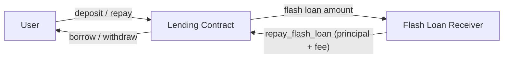
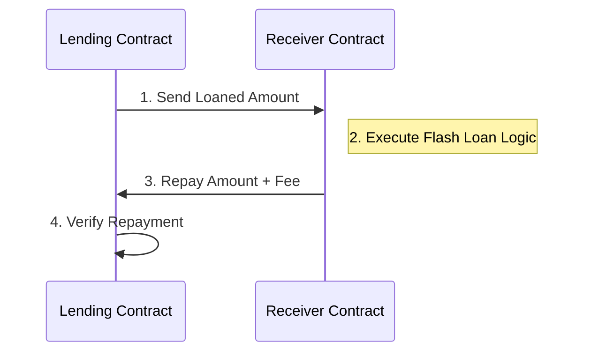

# StellarLend Lending Contract

A secure, efficient lending protocol built on Soroban that allows users to deposit collateral, borrow against it, repay debt, and participate in liquidations. Flash loans and emergency lifecycle controls are also available.

> **Documentation generation note**: this file is maintained by hand and must be
> kept in sync with `stellar-lend/contracts/lending/src/lib.rs`. After any
> change to a `pub fn` in `lib.rs`, update this file and
> `docs/interface_quick_reference.md` in the same PR. Run
> `cargo test -p stellarlend-lending` to verify no regressions.

---

## Features

- **Collateralized Borrowing**: Borrow assets by providing collateral with configurable liquidation thresholds.
- **Interest Accrual**: Automatic interest calculation based on protocol parameters.
- **Risk Management**: Protocol-level debt ceilings, deposit caps, and liquidation incentives.
- **Flash Loans**: Zero-collateral, single-transaction loans with configurable fees.
- **Granular Pausing**: Ability to pause specific operations (Deposit, Borrow, Repay, Withdraw, Liquidation) or the entire protocol.
- **Emergency Lifecycle**: `Normal -> Shutdown -> Recovery -> Normal` flow for handling catastrophic events.
- **Multi-sig Governance**: Secure upgrade mechanism requiring multiple approvals.
- **Persistent Data Store**: Versatile storage system with backup/restore and migration capabilities.
- **Arithmetic Safety**: Protection against overflow/underflow using checked arithmetic.
- **Indexable Events**: Versioned event emission for all core operations (deposit, withdraw, borrow, repay, liquidate) enabling off-chain indexing and monitoring.

## Building

```bash
cargo build --target wasm32-unknown-unknown --release
```

## Testing

```bash
cargo test -p stellarlend-lending
```

---

## Contract Interface

The table below reflects the **shipping** surface of `src/lib.rs` as of this branch. Functions marked **🔮 Planned** do not exist yet.

### Initialization

| Function | Signature | Auth | Description |
|---|---|---|---|
| `initialize` | `(env, admin: Address)` | — | One-time setup; sets admin and initial `EmergencyState::Normal`. Reverts if already initialized. |
| `get_admin` | `(env) → Address` | — | Returns the current admin address. |
| `propose_admin` | `(env, new_admin: Address)` | current admin | Step 1 of two-step admin transfer. Stores the proposed address. |
| `accept_admin` | `(env)` | proposed admin | Step 2: accepts the role committed by `propose_admin`. |
| `set_guardian` | `(env, guardian: Address)` | admin | Stores the guardian address allowed to enter `Shutdown`. |
| `get_guardian` | `(env) → Option<Address>` | — | Returns the configured guardian address, if any. |

### User Operations

| Function | Signature | Auth | Returns | Description |
|---|---|---|---|---|
| `deposit` | `(env, user: Address, amount: i128) → Result<i128, LendingError>` | `user` | New collateral balance | Adds `amount` to the user's collateral. Enforces deposit cap. Blocked during Shutdown. |
| `withdraw` | `(env, user: Address, amount: i128) → Result<i128, LendingError>` | `user` | New collateral balance | Removes `amount` from the user's collateral. Only allowed in Normal and Recovery states. |
| `borrow` | `(env, user: Address, amount: i128) → Result<i128, LendingError>` | `user` | Updated debt principal | Increases user debt; enforces `min_borrow`, post-borrow health factor (`>= 1.0`), and protocol debt ceiling. Blocked during Shutdown/Recovery. |
| `repay` | `(env, user: Address, amount: i128) → Result<i128, LendingError>` | `user` | Remaining debt principal | Reduces user debt with interest accrued up to the current timestamp. Allowed in Normal and Recovery. |
| `liquidate` | `(env, liquidator: Address, borrower: Address, amount: i128) → Result<i128, LendingError>` | `liquidator` | Actual debt repaid | Repays up to 50% of an undercollateralized borrower's debt and seizes proportional collateral (+ 10% bonus). Reverts if position is healthy (`hf >= 10000`). |

### Flash Loans

| Function | Signature | Auth | Description |
|---|---|---|---|
| `flash_loan` | `(env, initiator: Address, receiver: Address, asset: Address, amount: i128, params: Bytes)` | `initiator` | Transfers `amount` to `receiver`, calls `on_flash_loan(initiator, asset, amount, fee, params)`, then verifies full repayment including fee. |
| `repay_flash_loan` | `(env, payer: Address, asset: Address, amount: i128)` | `payer` | Called by the receiver flow to move principal + fee from `payer` back to treasury storage. |

> **Flash loan fee**: controlled by `DataKey::FlashFeeBps` (default 5 bps = 0.05%) and set through `set_flash_fee`.

### View Functions

| Function | Signature | Returns | Description |
|---|---|---|---|
| `get_position` | `(env, user: Address) → PositionSummary` | `{ collateral: i128, debt: i128, health_factor: i128 }` | Returns collateral balance, effective debt (principal + accrued interest), and health factor (`col * 8000 / debt`; `100_000_000` when debt is zero). Extends TTL on read. |
| `get_debt_position` | `(env, user: Address) → DebtPosition` | `{ principal: i128, last_update: u64 }` | Raw debt state; useful for debugging or off-chain interest simulation. Extends TTL on read. |
| `get_min_borrow` | `(env) → i128` | `i128` | Returns the current minimum borrow amount (default `0`). |
| `get_rate_smoothing_state` | `(env) → RateSmoothingState` | `{ schema_version: u32, current_rate_bps: i128, last_target_rate_bps: i128, last_update_ledger: u32 }` | Returns the persisted borrow-rate smoothing state without recomputing rates or mutating storage. |
| `get_health_factor` | `(env, user: Address) → i128` | `i128` | Convenience health-factor view using the same liquidation threshold scale; returns the no-debt sentinel when debt is zero. |
| `get_protocol_metrics` | `(env) → ProtocolMetrics` | `{ total_borrow: i128, total_supply: i128, utilization_bps: i128, ledger: u32 }` | Returns aggregate borrow/supply utilization and the current ledger sequence. |

### Oracle Price Controls

| Function | Signature | Auth | Description |
|---|---|---|---|
| `set_oracle_pubkey` | `(env, pubkey: BytesN<32>)` | admin | Stores the Ed25519 public key used to verify signed price updates. |
| `get_oracle_pubkey` | `(env) → Option<BytesN<32>>` | — | Returns the configured oracle public key, if any. |
| `set_price` | `(env, caller: Address, asset: Address, price: i128, timestamp: u64, signature: BytesN<64>) → Result<(), LendingError>` | `caller` must be admin | Verifies a signed price payload and stores a fresh `PriceRecord` for `asset`. |
| `get_price_record` | `(env, asset: Address) → Option<PriceRecord>` | — | Returns the stored oracle price and timestamp for `asset`, if present. |

### Admin & Risk Controls

| Function | Signature | Auth | Description |
|---|---|---|---|
| `set_min_borrow` | `(env, min_borrow: i128) → Result<(), LendingError>` | admin | Sets the minimum amount required to open or increase a borrow. |
| `set_debt_ceiling` | `(env, ceiling: i128) → Result<(), LendingError>` | admin | Sets the maximum total protocol debt. |
| `upgrade_init` | `(env, caller: Address, current_wasm_hash: BytesN<32>, required_approvals: u32) → Result<(), LendingError>` | admin | One-time upgrade governance bootstrap. |
| `upgrade_propose` | `(env, caller: Address, new_wasm_hash: BytesN<32>, new_version: u32) → Result<u64, LendingError>` | admin | Timelocked WASM upgrade proposal (`MIN_THRESHOLD_DELAY_LEDGERS` ETA). |
| `upgrade_approve` | `(env, caller: Address, proposal_id: u64) → Result<u32, LendingError>` | approver | Records an approval toward the snapshotted threshold. |
| `upgrade_execute` | `(env, caller: Address, proposal_id: u64) → Result<(), LendingError>` | approver | Calls `update_current_contract_wasm` after timelock + threshold checks. |
| `upgrade_add_approver` / `upgrade_remove_approver` | `(env, caller, approver) → Result<(), LendingError>` | admin | Manage the authorized approver set (max 32). |
| `upgrade_set_required_approvals` | `(env, caller, required_approvals) → Result<(), LendingError>` | admin | Updates the live threshold for future proposals only. |
| `upgrade_status` / `current_version` / `current_wasm_hash` | view | — | Query upgrade proposal state and active version/hash. |
| `set_flash_fee` | `(env, fee_bps: i128) → Result<(), LendingError>` | admin | Sets the flash-loan fee in the inclusive range `[0, 1000]` bps. |
| `set_emergency_state` | `(env, new_state: EmergencyState)` | admin or guardian | Transitions between `Normal`, `Shutdown`, and `Recovery`. Emits `EmergencyStateChanged` event. |
| `set_pause` | `(env, pause_type: PauseType, paused: bool, ttl_ledgers: u32)` | admin or guardian | Sets or clears a granular pause flag. `ttl_ledgers` is added to the current ledger to compute expiry. `ttl_ledgers = 0` means the pause expires immediately. `paused = false` is a valid unpause. Emits `PauseStateChangedEvent`. |
| `get_pause_state` | `(env, pause_type: PauseType) → bool` | — | Returns `true` if the operation is paused (own flag or `All` override). |

### Emergency State Machine

```
Normal ──► Shutdown ──► Recovery ──► Normal
```

| State | Deposit | Borrow | Repay | Withdraw |
|---|---|---|---|---|
| `Normal` | ✅ | ✅ | ✅ | ✅ |
| `Shutdown` | ❌ | ❌ | ❌ | ❌ |
| `Recovery` | ❌ | ❌ | ✅ | ✅ |

### Error Reference

| Variant | Code | Description |
|---|---|---|
| `LendingError::InvalidAmount` | 1001 | Amount is zero or negative. |
| `LendingError::Overflow` | 1002 | Checked arithmetic overflow during the operation. |
| `LendingError::Unauthorized` | 1003 | Caller lacks permissions for this operation. |
| `LendingError::BelowMinimumBorrow` | 1008 | Borrow amount is below the protocol minimum. |
| `LendingError::NotInitialized` | 1009 | Contract has not been initialized. |
| `LendingError::AlreadyInitialized` | 1010 | `initialize` called on an already-live contract. |
| `LendingError::PositionHealthy` | 1011 | Liquidation rejected — health factor is sufficient. |
| `LendingError::DebtCeilingExceeded` | 2001 | Borrow would exceed the global debt ceiling. |
| `LendingError::DepositCapExceeded` | 2002 | Deposit would exceed the total deposit cap. |
| `LendingError::InvalidFeeBps` | 2005 | Flash loan fee is outside the permitted range. |
| `LendingError::InsufficientCollateral` | 2007 | Collateral is too low for the requested operation. |
| `LendingError::SelfLiquidation` | 2008 | Liquidation rejected because the caller is also the borrower. |
| `LendingError::InvalidOracleSignature` | 5001 | Oracle price update signature is invalid. |
| `LendingError::StaleOracleTimestamp` | 5002 | Oracle price update is too old. |
| `LendingError::OraclePubkeyNotSet` | 5003 | Oracle public key is missing from storage. |
| `LendingError::UpgradeNotInitialized` | 3001 | Upgrade governance has not been initialized. |
| `LendingError::ProposalNotFound` | 3002 | Unknown upgrade proposal id. |
| `LendingError::ProposalNotReady` | 3003 | Timelock has not elapsed. |
| `LendingError::ProposalExpired` | 3004 | Proposal expiry ledger has passed. |
| `LendingError::ProposalAlreadyExecuted` | 3005 | Proposal was already executed. |
| `LendingError::AlreadyApproved` | 3006 | Duplicate approval from the same signer. |
| `LendingError::InsufficientUpgradeApprovals` | 3007 | Approval threshold not met. |
| `LendingError::InvalidUpgradeVersion` | 3008 | Proposed version is not greater than the current version. |
| `LendingError::ApproverNotFound` | 3009 | Approver is not in the configured set. |
| `LendingError::MaxApproversReached` | 3010 | Approver set is at capacity. |
| `LendingError::InvalidUpgradeConfig` | 3011 | Invalid upgrade configuration (e.g. zero threshold). |

---

## 🔮 Planned Features

The functions listed below appear in older documentation but are **not yet implemented** in `src/lib.rs`. They are tracked for future milestones.

| Function | Notes |
|---|---|
| `set_oracle(env, admin, oracle)` | External oracle contract adapter; signed `set_oracle_pubkey` / `set_price` flow is implemented today. |
| `set_liquidation_threshold_bps(env, admin, bps)` | Configurable liquidation threshold (currently hardcoded at 8000 BPS). |
| `set_close_factor_bps(env, admin, bps)` | Configurable close factor (currently hardcoded at 5000 BPS). |
| `get_collateral_value(env, user)` | USD-denominated collateral value (requires oracle). |
| `get_debt_value(env, user)` | USD-denominated debt value (requires oracle). |
| `get_max_liquidatable_amount(env, user)` | Convenience helper for liquidators. |
| `get_emergency_state(env)` | Public view for current lifecycle state (today exposed only via events). |
| `deposit_collateral(env, user, asset, amount)` | Multi-asset collateral support. |
| `data_store_init / data_save / data_load / data_backup / data_restore` | Persistent data-store management helpers. |

---

## Token Transfer Flows



## Event Emission

The lending contract emits versioned events for all core fund-moving operations to enable off-chain indexing, monitoring, and analytics.

### Emitted Events

All events carry a `schema_version` field for safe decoding across contract upgrades. Current schema version: `1`

- **SchemaVersionEvent**: Emitted once during `initialize()` to anchor the active schema version for indexers.
- **DepositEvent**: Emitted when a user deposits collateral. Contains user address, amount deposited, new collateral balance, and timestamp.
- **WithdrawEvent**: Emitted when a user withdraws collateral. Contains user address, amount withdrawn, new collateral balance, and timestamp.
- **BorrowEvent**: Emitted when a user borrows against collateral. Contains user address, amount borrowed, new debt principal, and timestamp.
- **RepayEvent**: Emitted when a user repays debt. Contains user address, amount repaid, new debt principal, and timestamp.
- **LiquidateEvent**: Emitted when a liquidator liquidates an undercollateralized position. Contains liquidator address, borrower address, repaid debt amount, seized collateral amount, borrower's remaining debt, borrower's remaining collateral, and timestamp.

### Event Guarantees

- Events are emitted **only on successful operations** after state mutations complete.
- Events **do not expose sensitive data** (e.g., private keys, authentication tokens).
- Event field order is **stable** within a schema version.
- Schema version changes follow the **upgrade policy** defined in `docs/EVENT_SCHEMA_VERSIONING.md`.

### Indexer Integration

For detailed guidance on consuming these events in indexers and handling schema migrations, see:
- [Event Schema Versioning Guide](../../../docs/EVENT_SCHEMA_VERSIONING.md)

Example: Decoding a DepositEvent in TypeScript
```typescript
interface DepositEvent {
  schema_version: number;
  user: string;
  amount: bigint;
  new_balance: bigint;
  timestamp: number;
}

function decodeDepositEvent(eventData: any): DepositEvent {
  if (eventData.schema_version !== 1) {
    throw new Error(`Unsupported schema version: ${eventData.schema_version}`);
  }
  return {
    schema_version: eventData.schema_version,
    user: eventData.user,
    amount: BigInt(eventData.amount),
    new_balance: BigInt(eventData.new_balance),
    timestamp: eventData.timestamp
  };
}
```

## View Serialization Stability

The contract treats the current struct-returning getter responses as view schema `v1`.

Covered getters:

- `get_user_debt() -> DebtPosition`
- `get_user_collateral() -> BorrowCollateral`
- `get_user_collateral_deposit() -> DepositCollateral`
- `get_user_position() -> UserPositionSummary`

Wire-format guarantee:

- Soroban `#[contracttype]` structs encode as XDR maps keyed by field name.
- The generated conversion code sorts those keys lexicographically, so the on-wire key order is deterministic.
- Snapshot-style tests lock the current XDR encoding for the getter structs above.

Stable decoding guidance:

- Decode these responses by field name, not by source declaration order.
- Treat the current field set and field names as schema `v1`.
- Do not assume a new field can be added safely to an existing getter response. Even additive changes can break strict decoders and hash-based snapshots.

Versioning strategy:

- Existing getter response structs are preserved in place for schema `v1`.
- Any additive or breaking change to one of the getter structs must ship as a new versioned getter/type, for example `get_user_position_v2()`, instead of mutating the current response shape.
- A runtime `schema` field is intentionally not added to the existing structs because that would itself be a breaking ABI change for the current getter surface.

## Contract Interface

### Flash Loan Flow


## Security & Trust Boundaries

### Authorization & Access Control
- **Admin**: Manages risk parameters, emergency state, and admin handoff.
- **Guardian**: Optionally stored at `DataKey::Guardian`; falls back to admin if not set. Authorized to call `set_emergency_state` and `set_pause`.
- **User**: `deposit`, `withdraw`, `borrow`, `repay` each call `user.require_auth()`.
- **Liquidator**: `liquidate` calls `liquidator.require_auth()`.

### Execution Safety
- **Reentrancy**: Flash loans set `DataKey::FlashActive = true` before the external call and clear it after. `deposit`, `withdraw`, and `repay` panic if the guard is active.
- **Arithmetic Integrity**: All storage mutations use `checked_add` / `checked_sub`; overflows return `LendingError::Overflow` or panic with an informative message.
- **Multi-User Isolation**: Storage keys include the user `Address` (e.g., `DataKey::Collateral(user)`), guaranteeing strict per-address namespacing — verified by `test_multi_user_isolation` in `src/lib.rs`.

---

## Documentation

- [Interface Quick Reference](../../../../docs/interface_quick_reference.md) — compact, integrator-focused function table.
- [Storage Layout](../../../../docs/storage.md) — persistent key schema and TTL policy.
- [Developer Glossary](../../../../docs/glossary.md) — key protocol terms and numeric scales.
- [Liquidation Accrual Notes](LIQUIDATE_ACCRUAL_NOTES.md) — details the settle-then-liquidate ordering guarantee and worked numeric examples.
- [Liquidation Mechanics](../LIQUIDATION_MECHANICS.md) — detailed liquidation formulas and examples.

## License

See repository root for license information.
