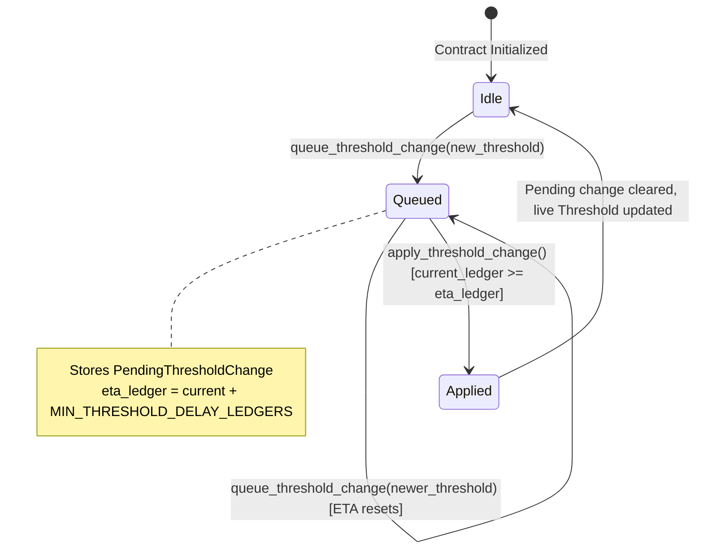
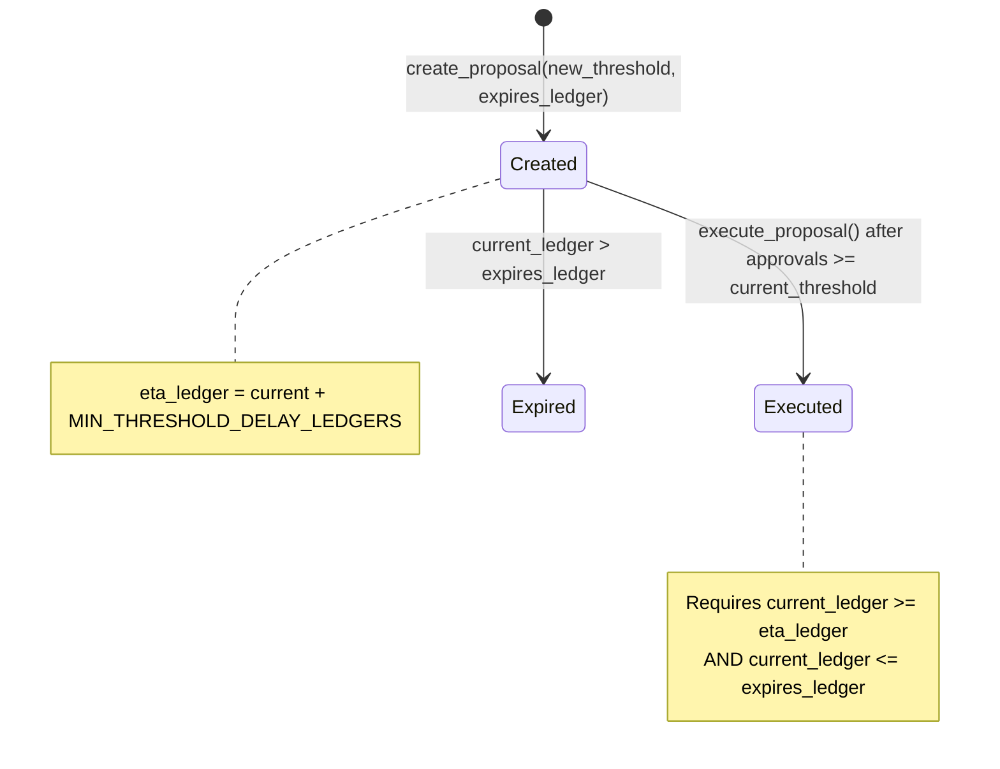
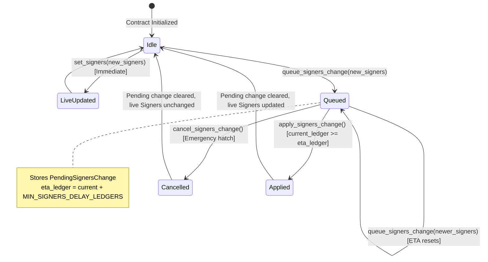

# Multisig Two-Phase Change Lifecycle & Timelock

This document describes the two-phase change lifecycle and timelocks implemented in the Multisig contract (`stellar-lend/contracts/multisig`). These mechanisms protect the protocol against compromise and immediate quorum takeover by requiring all critical governance changes to go through a delayed queue-and-apply process.

---

## 1. Overview & Threat Model

The primary security invariant of the multisig contract is to prevent a compromised quorum or admin key from taking over governance in a single ledger. 

If an attacker temporarily controls the admin key or a minimum signers quorum, they might attempt to:
1. Lower the threshold to `1` to execute subsequent proposals unilaterally.
2. Replace the signer set with their own controlled keys.

To mitigate this, the contract enforces:
- **Mandatory Cooldowns (Timelocks)**: Changes to thresholds or signer sets do not take effect immediately (except via the emergency `set_signers` path, which requires direct admin transaction authorization). They must be queued and can only be applied after a cooldown period has elapsed.
- **Emergency Cancellation**: Queued signer set changes can be cancelled at any time during the cooldown window.
- **Allowlist Gates**: Execution of pending proposals can be blocked by disallowing the proposal's action kind.

---

## 2. State & Lifecycle Diagrams

### Threshold Change Lifecycle
Threshold changes can be updated via two pathways: the admin-direct workflow (queue/apply) or the standard proposal-based workflow (create/approve/execute).

#### Path A: Admin-Direct Workflow

#### Path B: Proposal-Based Workflow

---

### Signers Change Lifecycle
Signer set changes can also be set immediately by the admin (emergency) or queued (standard two-phase review).

---

## 3. Cooldown & Timelock Durations

Cooldown durations are defined as ledger-sequence offsets. Assuming an average block time of 5 seconds, the durations are:

| Duration Name | Ledger Value | Time Equivalent | Storage/Location |
| :--- | :--- | :--- | :--- |
| `MIN_THRESHOLD_DELAY_LEDGERS` | `600_000` | ~7 days | Constant in `src/lib.rs` |
| `MIN_SIGNERS_DELAY_LEDGERS` | `600_000` | ~7 days | Constant in `src/lib.rs` |
| `DEFAULT_PROPOSAL_EXPIRY_LEDGERS` | `1_200_000` | ~14 days | Constant in `src/lib.rs` |

### Inspectors
The contract provides public getter functions to inspect these configurations:
- `get_min_threshold_delay_ledgers(_env: Env) -> u32`
- `get_min_signers_delay_ledgers(_env: Env) -> u32`
- `get_default_expiry_ledgers(_env: Env) -> u32`

---

## 4. Lifecycle Transitions & Events

### Threshold Changes

#### 1. Queue Threshold Change
- **Fn**: `queue_threshold_change(env: Env, new_threshold: u32)`
- **Auth**: Admin (`require_auth`)
- **Action**: Computes `eta_ledger = current_ledger + MIN_THRESHOLD_DELAY_LEDGERS` and saves a `ThresholdChange` struct in `DataKey::PendingThresholdChange`. Overwrites any active queue and resets the ETA.
- **Events**: `ThresholdChangeQueuedEvent`
  - `admin`: The admin performing the queue.
  - `new_threshold`: The proposed threshold value.
  - `eta_ledger`: The ledger sequence after which it can be applied.

#### 2. Apply Threshold Change
- **Fn**: `apply_threshold_change(env: Env)`
- **Auth**: Admin (`require_auth`)
- **Action**: Asserts that `current_ledger >= eta_ledger`. Sets the live threshold to `new_threshold` and removes `DataKey::PendingThresholdChange`.
- **Events**: `ThresholdChangeAppliedEvent`
  - `admin`: The admin applying the change.
  - `old_threshold`: The previous threshold value.
  - `new_threshold`: The newly applied threshold.
  - `ledger`: The applying ledger sequence number.

---

### Signers Changes

#### 1. Queue Signers Change
- **Fn**: `queue_signers_change(env: Env, new_signers: Vec<Address>)`
- **Auth**: Admin (`require_auth`)
- **Action**: Computes `eta_ledger = current_ledger + MIN_SIGNERS_DELAY_LEDGERS` and saves a `SignersChange` struct in `DataKey::PendingSignersChange`. Overwrites any active queue and resets the ETA.
- **Events**: `SignersChangeQueuedEvent`
  - `admin`: The admin performing the queue.
  - `eta_ledger`: The ledger sequence after which it can be applied.

#### 2. Apply Signers Change
- **Fn**: `apply_signers_change(env: Env)`
- **Auth**: Admin (`require_auth`)
- **Action**: Asserts that `current_ledger >= eta_ledger`. Overwrites live signers at `DataKey::Signers` and removes `DataKey::PendingSignersChange`.
- **Events**: `SignersChangeAppliedEvent`
  - `admin`: The admin applying the change.
  - `ledger`: The applying ledger sequence.

#### 3. Cancel Signers Change
- **Fn**: `cancel_signers_change(env: Env)`
- **Auth**: Admin (`require_auth`)
- **Action**: Removes `DataKey::PendingSignersChange` immediately. The live signer set remains unchanged.
- **Events**: `SignersChangeCancelledEvent`
  - `admin`: The admin cancelling the change.
  - `ledger`: The cancellation ledger sequence.

#### 4. Direct (Immediate) Signers Update
- **Fn**: `set_signers(env: Env, signers: Vec<Address>)`
- **Auth**: Admin (`require_auth`)
- **Action**: Bypasses the queue and immediately updates the live signer set. Use for emergency rotation.
- **Events**: None.

---

## 5. Storage Layout Reference

| Key | Type | Description |
| :--- | :--- | :--- |
| `DataKey::Threshold` | `u32` | The active, live threshold value. |
| `DataKey::Signers` | `Vec<Address>` | The active, live signer set. |
| `DataKey::PendingThresholdChange` | `ThresholdChange` | Contains `{ new_threshold: u32, eta_ledger: u32 }` |
| `DataKey::PendingSignersChange` | `SignersChange` | Contains `{ new_signers: Vec<Address>, eta_ledger: u32 }` |
